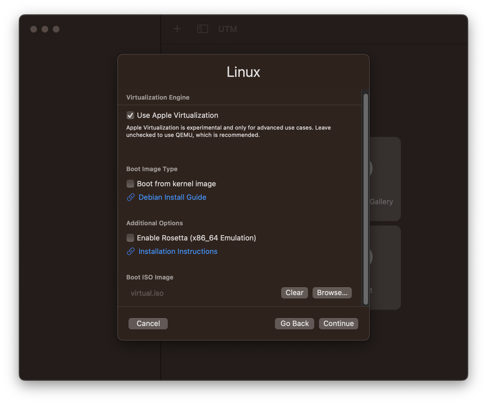
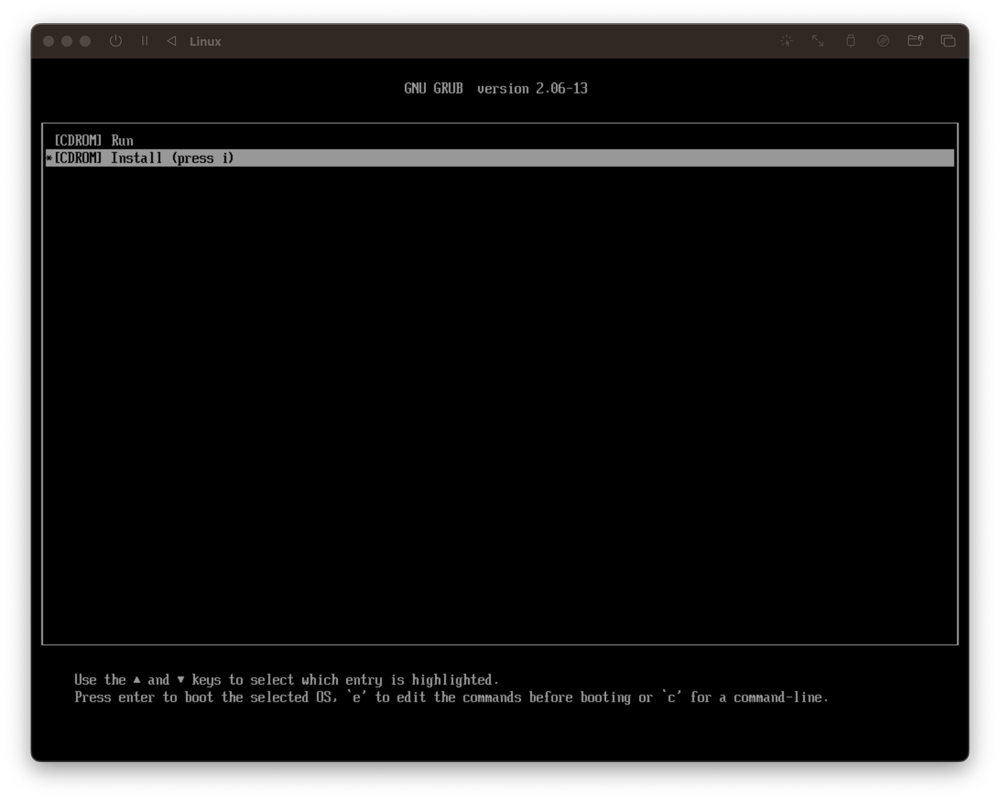

# installer

Build iso images to automatically install Debian 12

## Dependencies

[Nix OS](https://nixos.org/) is used for the development/build/deployment environment

**Install nix:**

```sh
curl -L https://nixos.org/nix/install | sh
```

**Enter a shell:**

```sh
nix-shell
```

## Images

The default `make` goal builds all the images

### virtual

```sh
make bootstrap/virtual.iso
```

The image can be installed in a [UTM](https://mac.getutm.app) virtual machine :



At first boot, select the `[CDROM] Install` grub entry :



The installation is fully automatic and Debian starts without other manipulation. At first boot, an [Ansible](https://docs.ansible.com) playbook runs inside the virtual machine, installing everything in about one minute

Log you with :

```sh
ssh -F .ssh/virtual/config david@virtual.local
```

You can include the ssh config it in your home config :

```sh
echo "Include $(pwd)/configure/*/ssh/config" >> ~/.ssh/config
```

To run the Ansible playbook manually :

```sh
ansible-playbook -i inventory/virtual.local virtual.yml
```
